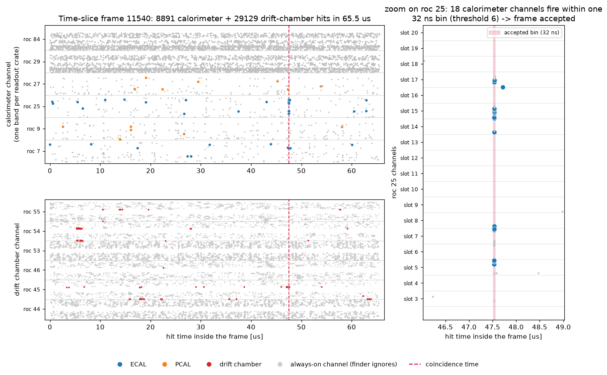

# autoresearch-for-you

Run your own autonomous LLM optimization loop on real physics software, and
compare what your agent achieves against the original run.

The subject is a streaming-readout (SRO) EVIO decoding chain from Jefferson
Lab beam tests: a JANA2 plugin (`evio6_file`) plus a decode library
(`evio_sro_parser`) that read a 15.5 GB file of real streaming data, select
~4% of the ~65 µs time-slice frames with a coincidence finder, and write the
hits to ROOT RNTuples. The chain in this repository works, is validated, and
is deliberately unoptimized: single thread, eager parsing, serial writer,
~95 MB/s.

This repository freezes that state — the exact starting point of the original
autoresearch run. An agent given [optimize.md](optimize.md) ran a
hypothesis-driven optimization loop (one change, one measurement, one
correctness gate at a time) and finished at ~3.0 GB/s cold-cache / 4.2 GB/s
hot — see [RESULTS.md](RESULTS.md) for the reference waterfall (spoilers).

Point your LLM at `optimize.md` and see where it gets.

## The data, and what the chain looks for



One time-slice frame of the input file. The horizontal axis is hit time inside
the 65.5 µs frame; the vertical axis is readout channel, grouped into one band
per readout crate (`roc`) — calorimeter crates on top, drift chambers below.
Blue and orange are calorimeter hits, red is drift chamber. Grey marks the
always-on channels listed in `config/hot_channels.csv`: they fire continuously
regardless of physics, and the finder ignores them.

The frame holds 8891 calorimeter and 29 129 drift-chamber hits, and almost all
of it is noise. A particle shower is instead a **time coincidence**: many
channels of one crate firing together within a few nanoseconds. That is what the
finder searches for — it bins the clean calorimeter hits into 32 ns bins and
accepts the frame when any single bin holds 6 or more hits.

The dashed red line marks the bin that fired here, at 47.52 µs. The right panel
zooms in on it: 18 channels of crate `roc 25`, spread across slots 5 to 17,
all inside one 32 ns bin — a shower localized in both time and space, with a
matching drift-chamber cluster at the same instant. Everywhere else in the
frame, hits are scattered at random.

About 4% of frames contain such a coincidence. Dropping the other 96% is what
makes the chain's output small, and getting that decision made faster is the
whole optimization problem. To render this figure from your own run, use
[docs/make_frame_display.py](docs/make_frame_display.py) (a reading aid for
humans, not part of the loop).

## Repository layout

| Path | What it is |
|---|---|
| `jana4ml4fpga/` | The source tree at the pre-optimization state, stripped to the SRO chain: the `evio6_file` plugin, the `evio_sro_parser` library, the log service and the CLI (~46 files). Self-contained: CMake fetches and builds JANA2/spdlog/fmt if not preinstalled; only ROOT is required. See [its README](jana4ml4fpga/README.md) for components and parameters. |
| `config/hot_channels.csv` | Calibration input of the locked coincidence finder (always-on channels to ignore). Part of the fixed workload — do not regenerate. |
| `optimize.md` | The task prompt for the agent: working rules + the optimization loop protocol. |
| `docker/` | Dockerfile for `eicdev/eic-claude` (EIC software stack + Claude Code + uv). |
| `docs/running-docker.md` | How to run the container: every flag explained, login, headless run, gotchas. |
| `docs/make_frame_display.py` | Renders the frame picture above from a chain output file. Optional reading aid. |
| `RESULTS.md` | Reference results from the original run. Read after your own run. |

## Quick start

### 1. Clone

```bash
git clone https://github.com/JeffersonLab/autoresearch-for-you.git
```

### 2. Download the data

Download `sro_000791.evio.00000` (~15.5 GB) from the
[data folder on Google Drive](https://drive.google.com/drive/folders/1JY3jrZNp5qqdGV110iIQV3UImRva4XCH?usp=sharing)
and place it so the path is:

```
<your-data-dir>/sro_boyarinov_data_2026/sro_000791.evio.00000
```

`<your-data-dir>` is any directory with ~20 GB free; it is mounted into the
container as `/data`. Only file `.00000` is needed; the agent also writes its
builds and outputs under `<your-data-dir>/autoresearch/`.

### 3. Get the container

Pull the prebuilt image:

```bash
# Option A — Claude Code agent:
docker pull eicdev/eic-claude:latest

# Option B — Gemini CLI agent:
docker pull eicdev/eic-gemini:latest
```

Or build from [docker/](docker/):

```bash
# Claude Code:
docker build -t eicdev/eic-claude:latest docker/

# Gemini CLI:
docker build -t eicdev/eic-gemini:latest -f docker/Dockerfile.gemini docker/
```

### 4. Start the container

**Option A — Claude Code (`eic-claude`):**

```bash
docker run --rm -it --init \
  --user $(id -u):$(id -g) \
  -e HOME=/myhome \
  -e CLAUDE_CONFIG_DIR=/myhome/.claude \
  -e UV_CACHE_DIR=/data/autoresearch/uv-cache \
  -v ~/.claude-docker:/myhome/.claude \
  -v <your-data-dir>:/data \
  -v <path-to-this-clone>:/work \
  -w /work \
  eicdev/eic-claude:latest bash
```

**Option B — Gemini CLI (`eic-gemini`):**

```bash
docker run --rm -it --init \
  --user $(id -u):$(id -g) \
  -e HOME=/myhome \
  -e GEMINI_CONFIG_DIR=/myhome/.gemini \
  -e GEMINI_API_KEY=$GEMINI_API_KEY \
  -e UV_CACHE_DIR=/data/autoresearch/uv-cache \
  -v ~/.gemini-docker:/myhome/.gemini \
  -v <your-data-dir>:/data \
  -v <path-to-this-clone>:/work \
  -w /work \
  eicdev/eic-gemini:latest bash
```

Every flag matters; [docs/running-docker.md](docs/running-docker.md) explains
each one, the one-time login, and the known gotchas. Create `~/.claude-docker`
or `~/.gemini-docker` once before the first run (`mkdir -p ~/.claude-docker` or
`mkdir -p ~/.gemini-docker`) so credentials persist across containers.

### 5. Run the loop

**With Claude Code:**
Inside the container, log in once (`claude`, then `/login`, then `/exit`),
then start the autonomous run:

```bash
claude -p --model claude-fable-5 --dangerously-skip-permissions --verbose < /work/optimize.md
```

**With Gemini CLI:**
Inside the container (with `GEMINI_API_KEY` set, or authenticated via `gemini`),
start the autonomous run:

```bash
gemini --yolo -p "$(cat /work/optimize.md)"
```

Interactive alternative and log-capture variants: see
[docs/running-docker.md](docs/running-docker.md).

### 6. Watch and compare

The agent builds the chain, measures its own baseline, then runs the
experiment loop. Its trail as it works:

- `space/notes/STATUS.md` — current state, updated continuously.
- `space/notes/EXPERIMENTS.md` — the append-only hypothesis ledger.
- `space/perf/history.csv` — every measured run.
- `git log` in your clone — one commit per hypothesis
  (`autoresearch/v{n}_{name}`).
- `space/reports/experiment_report.md` — the final waterfall.

Compare against [RESULTS.md](RESULTS.md). Hardware differs, so compare
speedup ratios over your own baseline, not absolute MB/s.

## Building without docker (optional)

The chain builds on a bare Linux host with: a C++20 compiler, CMake ≥ 3.19,
ROOT ≥ 6.40 (RNTuple), and network access for the dependency fetch:

```bash
cmake -S jana4ml4fpga -B build -DCMAKE_INSTALL_PREFIX=build/install
cmake --build build -j $(nproc)
cmake --install build
```

The run recipe is in [optimize.md](optimize.md) (section "The chain you
optimize") — substitute your own paths.

The container (ROOT 6.38, gcc 13) is the verified runtime. On a newer host
toolchain (ROOT 6.40, gcc 15) the chain compiles but has been observed to
crash in the RNTuple writer — the starting-point code is deliberately naive
and carries at least one latent bug that newer toolchains expose. Treat a
bare-host run as unsupported territory (or as an early hint for your agent).

## Rules of the game

- Don't optimize the code by hand — the point is to see what the agent does.
- Keep the workload fixed and the correctness gate intact (both are defined in
  `optimize.md`); a faster chain that produces different output is a failed
  run.
- The interesting output is not only the final MB/s: read the agent's ledger.
  Which hypotheses did it try? Which did it reject, and were the reasons
  right?
